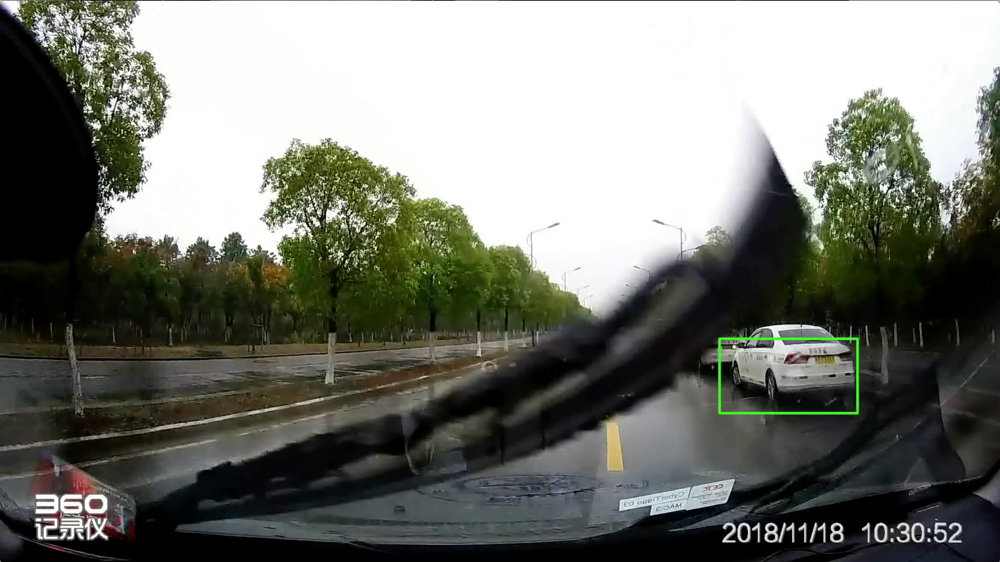
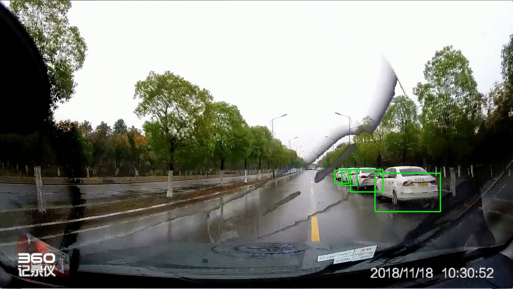

# RainWiperFilter
Filter out the rain wiper on a cyber car image or video.

The total repo breaks into 3 parts. The first trial is on classification, the second is about segmentation using traditional methods and the third is about semantic segmentation using U-Net or others.

- The first part is classification using AlexNet (and of course can be others). We classify out which of the  image belongs to, having a rain wiper or not. After classification, we simply change the image in the video directly into the former image of the time. The result is not ideal.
- The second part is using traditional segmentation of thresholding. Since the rain wiper is black and has a great difference with others. We can first segment it out by thresholding and then remove the pixel inside the thresholded area. At last we fill in these areas with the former image of the time getting a relatively better result as follow.

- The third part we are trying to use semantic segmentation. TO BE FINISHED